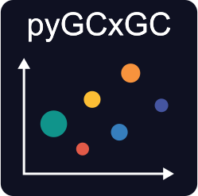
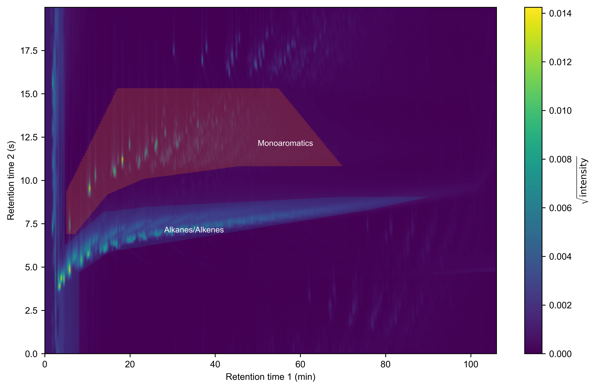

# pyGCxGC

<p align="center">
  
</p>

## Overview
pyGCxGC is a python package for processing of two dimensional Gas Chromatography (GCxGC) data.
Presently, it supports generating 2D chromatograms for detectors with one parameter, such as FID.

[](https://github.com/MyonicS/pyGCxGC/actions/workflows/tests.yaml)
[](https://github.com/MyonicS/pyGCxGC/actions/workflows/python-package.yml)

## Features
- Load 1D Chromatograms from a csv or a pandas dataframe
- Generate 2D Chromatograms
- Integrate areas in 2D Chromatograms using .tif masks
- GUI for generation of masks

<p align="center">
  
</p>

> **⚠️ WARNING**: pyGCxGC is under active development. Braking changes can occur. Please report any issues using the [Issue Tracker](https://github.com/MyonicS/pyGCxGC/issues).

## Installation

pyGCxGC is not yet available on PyPI. To install the latest development version, clone the repository and install it using pip:

```bash
git clone https://github.com/MyonicS/pyGCxGC.git
cd pyGCxGC
pip install .
```

in editable mode:

```bash
pip install -e .
```

> **Note**: The GUI functionality requires tkinter, which is included in most Python installations. If you're having issues with the GUI, ensure tkinter is installed on your system.

## Documentation

For a short tutorial, see the [Quickstart Notebook](docs/notebooks/Quickstart_notebook.ipynb).

## Quick Start

### Parsing and Plotting

Parse a 2D chromatogram from a CSV file or from a Dataframe with retention time (`Ret.Time[s]`) and `Absolute Intensity` columns:

```python
import pyGCxGC as gcgc
import numpy as np
from matplotlib import pyplot as plt

# Parse chromatogram
chrom = gcgc.parse_2D_chromatogram(
    'example_data/example_chromatograms/Example_FID.csv',
    modulation_time=20,  # seconds
    sampling_interval='infer',
    baseline_type='stridewise',
    normalize='volume',
    name='Example FID'
)

# Plot
plt.imshow(np.sqrt(chrom.chrom_2D), 
           cmap='viridis', 
           extent=chrom.limits, 
           aspect='auto')
plt.xlabel('Retention time 1 (min)')
plt.ylabel('Retention time 2 (s)')
plt.colorbar(label=r'$\sqrt{\mathrm{intensity}}$')
plt.show()
```

### Masking and Integration

Integrate specific regions using binary mask files:

```python
# Single mask
masked = gcgc.mask_chromatogram(chrom.chrom_2D, 'path/to/mask.tif')

# Multiple masks
results = gcgc.integrate_masks(
    chrom.chrom_2D, 
    masks='path/to/masks/',  # directory or list of paths
    mask_names='infer'
)
```

### Creating Masks with the GUI

The package includes a graphical user interface for creating masks for 2D chromatograms. 
The GUI allows you to load a chromatogram, draw regions of interest, and save them as binary mask files (`.tif`).

To launch the GUI from within Python:

```python
import pyGCxGC as gcgc

# Launch the mask creator GUI
gcgc.launch_mask_creator()
```

The GUI provides tools to:
- Load and visualize 2D chromatograms
- Draw masks using selection tools
- Add/remove selections to/from masks
- Save masks as .tif files for later use with pyGCxGC's masking functions

For a finer control, save the chromatogram as tif and create a mask image processing software such as ImageJ.