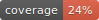

# pyGCxGC

<p align="center">
  
</p>
## Overview
pyGCxGC is a python package for processing of two dimensional Gas Chromatography (GCxGC) data.
Presently, it supports generating 2D chromatograms for detectors with one parameter, such as FID.

[](https://github.com/MyonicS/pyGCxGC/actions/workflows/tests.yaml)
[](https://github.com/MyonicS/pyGCxGC/actions/workflows/python-package.yml)


## Features
- Load 1D Chromatograms from a csv or a pandas dataframe
- Generate 2D Chromatograms
- Integrate areas in 2D Chromatograms using .tif masks

> **⚠️ WARNING**: pyGCxGC is under active development. Braking changes can occur. Please report any issues using the [Issue Tracker](https://github.com/MyonicS/pyGCxGC/issues).

## Installation

pyGCxGC is not yet available on PyPI. To install the latest development version, clone the repository and install it using pip:

```bash
git clone https://github.com/MyonicS/pyGCxGC.git
cd pyGCxGC
pip install .
```

in editable mode:

```bash
pip install -e .
```

> **Note**: The GUI functionality requires tkinter, which is included in most Python installations. If you're having issues with the GUI, ensure tkinter is installed on your system.

## Documentation

Check the Development Notebook to get started, more in-depth docs to be developed.

## Usage

### Parsing and plotting

To generate a 2D chromatogram object, you need either a csv or padnas dataframe with the retention time in seconds ('Ret.Time[s]') and a column labeled 'Absolute Intensity'.

```python
import pyGCxGC as gcgc
from matplotlib import pyplot as plt

chrom = gcgc.parse_2D_chromatogram(
    'example_data/example_chromatograms/Example_FID.csv',
    modulation_time=20,
    sampling_interval='infer'
)

# Plot the 2D chromatogram
import matplotlib.pyplot as plt
plt.imshow(chrom.chrom_2D, cmap='viridis', extent=chrom.limits, aspect='auto')
plt.xlabel('Retention time 1 (min)')
plt.ylabel('Retention time 2 (s)')
plt.colorbar(label='intensity')
plt.show()
```

### Integrating a specific area
To integrate a specific area, provide a binary mask as .tif file.
You can also provide a directory with multiple masks.

```python
# Integrate using a mask file
result = gcgc.integrate_masks(
    chrom.chrom_2D,
    masks='example_data/example_masks/Mask_1.tif'
)
print(result)
```

### Creating Masks with the GUI

The package includes a graphical user interface for creating masks for 2D chromatograms. 
The GUI allows you to load a chromatogram, draw regions of interest, and save them as binary mask files (`.tif`).

To launch the GUI from within Python:

```python
import pyGCxGC as gcgc

# Launch the mask creator GUI
gcgc.launch_mask_creator()
```

You can also launch it directly from the command line:

```bash
pygcxgc-maskcreator
```

The GUI provides tools to:
- Load and visualize 2D chromatograms
- Draw masks using rectangle or lasso selection tools
- Add/remove selections to/from masks
- Save masks as .tif files for later use with pyGCxGC's masking functions

For a detailed tutorial on using the Mask Creator GUI, see the `Mask_Creator_GUI.ipynb` notebook in the docs.